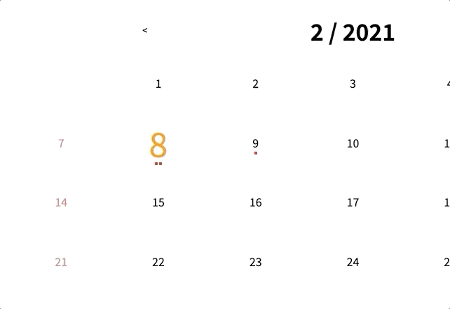
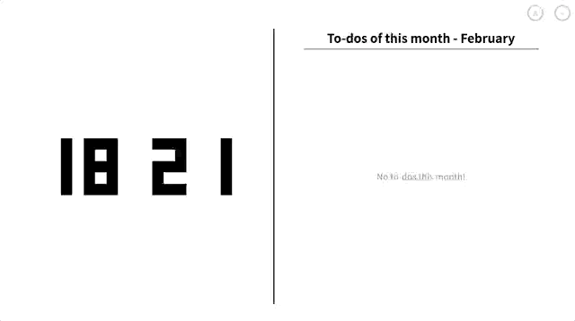

# nomad-todolist-contest
A simple To-do list application with **BIG THANKYOU TO [@Nomad Coders]**  
> link: [Github Pages]

## screenshots

## Features
- One page scroll w/ vanilla js
- Responsive design
- Calendars with tooltips
- Data handling with localStorage api
- modals for input
- etc

[@Nomad Coders]: https://github.com/nomadcoders
[Github Pages]: https://rudypark3091.github.io/nomad-todolist-contest
